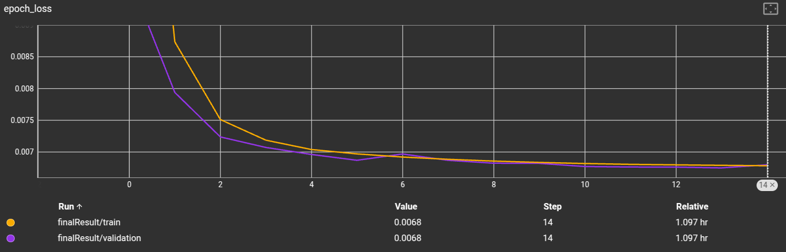
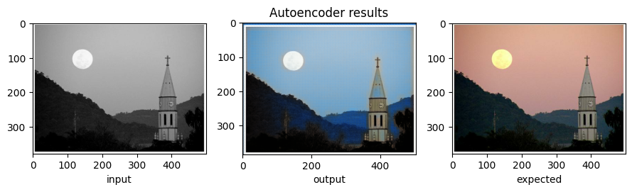
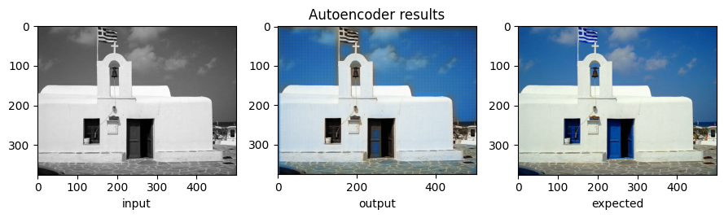
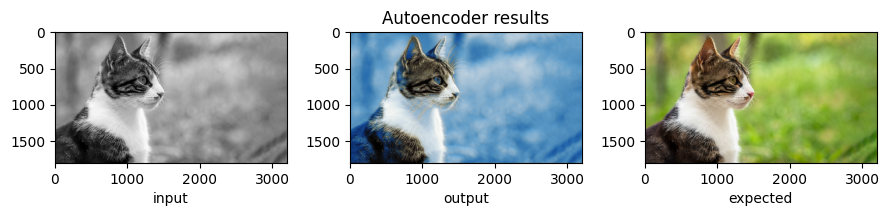
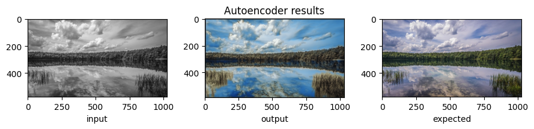
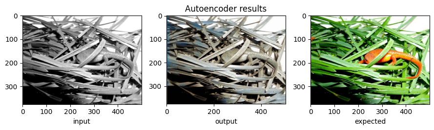
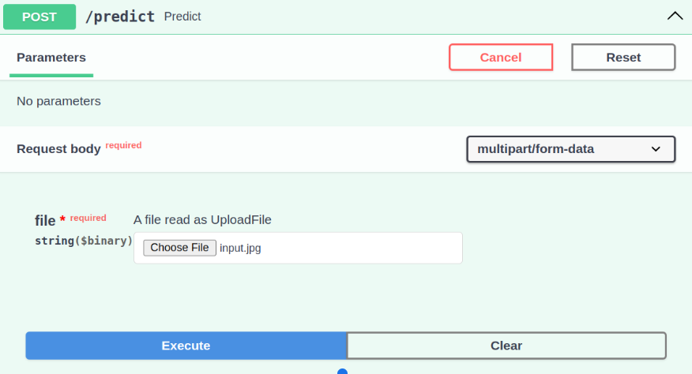
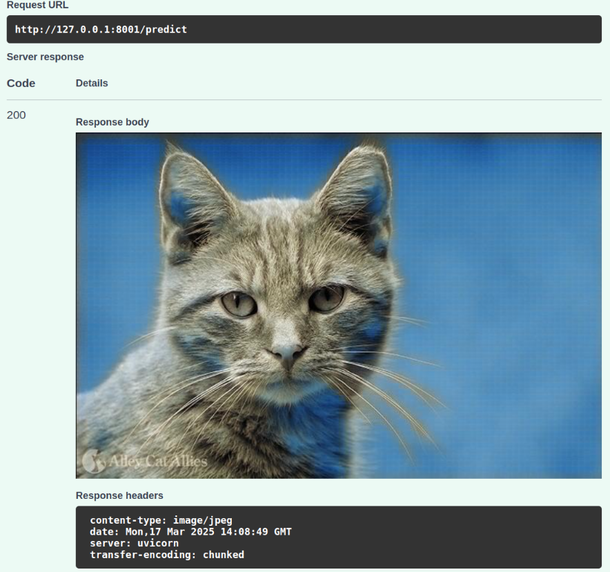

# Aplication to color gray image 🌈

This repository contains an autoencoder architecture implemented in [TensorFlow](https://www.tensorflow.org/), designed to colorize grayscale images. The results of experiments are tracked using [TensorBoard](https://www.tensorflow.org/tensorboard). Additionally, an API has been created for inference and prediction using [FastAPI](https://fastapi.tiangolo.com/).

## Features:
- Autoencoder-based architecture for image colorization.
- Integration with [TensorBoard](https://www.tensorflow.org/tensorboard) to track experiments and visualize results.
- API built with [FastAPI](https://fastapi.tiangolo.com/) for easy access to inference and predictions.


## Setup:

Clone this repository:
```bash
$git clone https://github.com/IgorCzudy/color_images.git
```

Create conda env:
```bash
$conda env create -f environment.yml
$conda activate colorimages
```

Run experiments:
```bash
$cd src
$python main.py
```
You can specify parameters values from console.
```bash
$cd src
$python main.py --batch_size=64 --learning_rate=1e-3
```

Or for greede search.
```bash
$./greedy_search.sh
```

## See experiments results:
```bash
$tensorboard --logdir=logs
```

The search for hyperparameters took place on 20% of the data due to large computational requirements. Then, training was performed on the entire dataset. The dataset used is 1/4 of the well-known [Imagenet](https://www.image-net.org/). For the purpose of this task, labels were dropped, and only images were used. These images were converted to grayscale as input, while the RGB values were kept as the target. Various hyperparameters were tested, such as batch size, kernel size, network architecture, and learning rate.


The plot below shows loss during learning proces (15 epoches) of the final model. 

<div style="text-align: center;">
  
</div>

## Prediction example

Model is doing well for simple imges souch as landscapes, lakes, mountains images. It is worse with a more complicated structure as the last example shows. In addition, the photos lose quality after interferance.

<div style="text-align: center;">
  
</div>

<div style="text-align: center;">
  
</div>


<div style="text-align: center;">
  
</div>


<div style="text-align: center;">
  
</div>


<div style="text-align: center;">
  
</div>


## FastAPI app
The FastAPI app for prediction is available on the `fastapiApp` branch.

```bash
$git checkout fastapiApp
```

### Build and Start the Application in a Docker Container

```bash
$docker build -t colorimgapp . 
$docker run -p 8000:8000 colorimgapp
```

After that, entering the root adres: [http://0.0.0.0:8000](http://0.0.0.0:8000) should return the following JSON response:
```
{
  "helth_check": "OK",
  "model_version": "0.1.0"
}
```

### Using the Application with Curl
You can use this application with `curl` from the terminal. For this purpose, you need a grayscale image. For example:

```bash
!wget https://www.vets4pets.com/siteassets/species/cat/cat-close-up-of-side-profile.jpg
!convert cat.jpg -colorspace Gray input.jpg
```
> [!NOTE]
> You cen use imagemagick to convert RGB image to gray scale. <br>
> `$sudo apt install imagemagick`

Then send a POST request. As a response, you should get an `output.jpg` image, which is the colorized version of the input:

```bash
curl -X 'POST' 'http://127.0.0.1:8001/predict' \
     -H 'accept: application/json' \
     -H 'Content-Type: multipart/form-data' \
     -F 'file=@input.jpg;type=image/jpeg' \
     --output output.jpg
```

### Testing with FastAPI Documentation
FastAPI also allows testing directly from the automatically generated documentation.  
1. Go to [http://127.0.0.1:8000/docs](http://127.0.0.1:8000/docs).  
2. Choose the `/predict` endpoint.  
3. Upload a grayscale image file and execute the request.  

As a response, you should get a colorized image, as shown below:  

<div style="text-align: center;">
  
</div>

<div style="text-align: center;">
  
</div>
